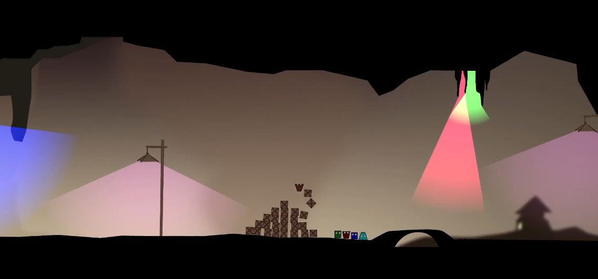
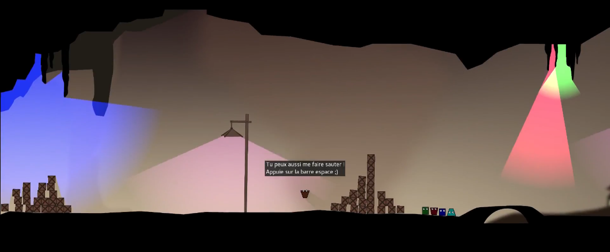
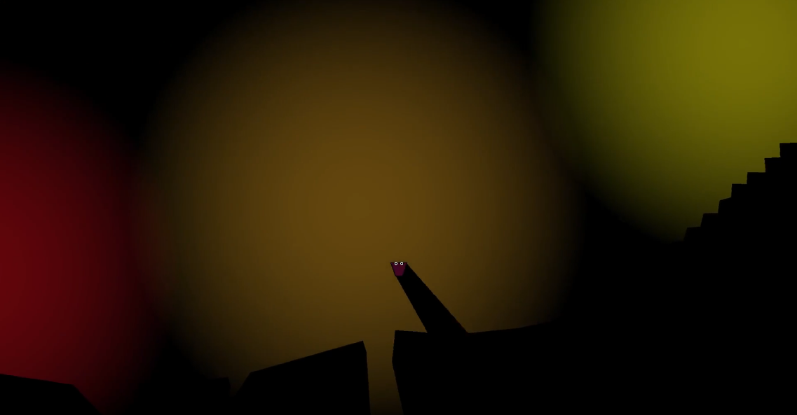

# TGE

totorigolo's Game Engine

# Introduction

This is a 2D game engine I wrote back in high school.
At that time, I used Mercurial, and didn't write any `README.md`.
I don't want to distort my work /o/

_Ok there was a `README.txt`, but it wasn't useful and it was written in French._

# Videos

I spent so time to finalize everything and record a nice video
of both the world editor and the level I create during the video.

They are both avaiable on YouTube:
* recording of the game: https://youtu.be/u4Kx7wohy_g
* recording of the editor: https://youtu.be/lWzNdNF35xY

# Screenshots

Physic simulation:

Dialogs & scripts:

Shadows:

